# Dynamic Simulated Annealing for the Stochastic and Dynamic CVRP

[](https://www.python.org/downloads/)
[](./LICENSE.txt)
[](./tests)
[](#case-study)

A dynamic simulated annealing algorithm that routes relief vehicles when demand is revealed only on arrival, re-planning the remaining tours after every delivery. In a case study of food distribution after the 2023 Turkish-Syrian earthquake it held a 100% service level in every trial, while an exact solver planning on expected demand fell as low as 7.32%.

*Bachelor's thesis, Technical University of Munich, graded 1.0.*

This repository implements a newly developed Dynamic Simulated Annealing (DSA) metaheuristic algorithm to solve the Stochastic and Dynamic Capacitated Vehicle Routing Problem (SDCVRP). Demands, sampled from a probability distribution, are revealed as vehicles deliver goods from a central depot to distribution points. Following a delivery, the transportation network is reoptimised according to the newly acquired information. Dynamic adaptation of the problem instance makes the DSA particularly well-suited to humanitarian logistics problems.

A case study on the distribution of food following the 2023 Turkish-Syrian earthquake is conducted to verify the performance of the algorithm. When compared in a deterministic setting, the new algorithm is inferior to an exact solution method. However, as demand becomes increasingly stochastic, it is the DSA that invariably outperforms the exact solution method.

---

## The result

<p align="center">
  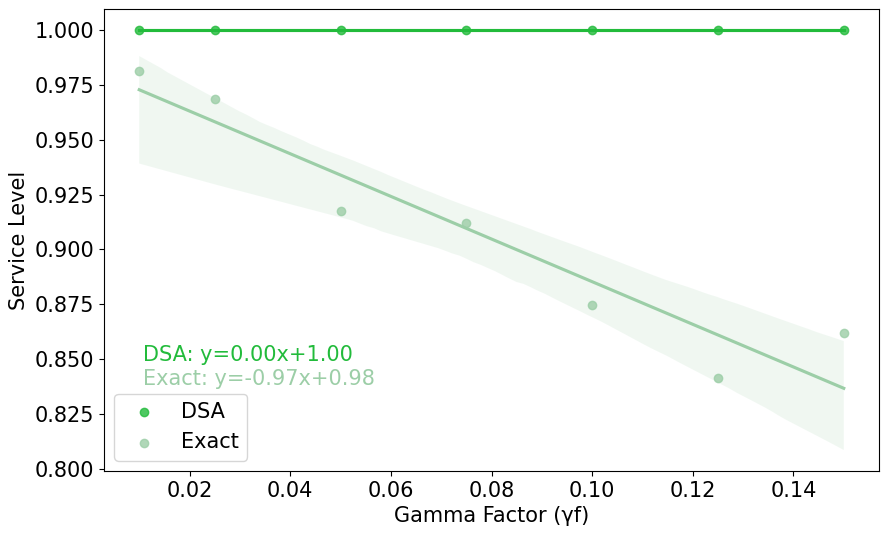
</p>

The DSA approach achieves a perfect service level as a result of its dynamic reoptimisation capabilities. Since the exact solution method has no possibility of reoptimisation, service levels fall.

| | Exact algorithm | **DSA** |
| --- | ---: | ---: |
| Service level, γf = 0.010 | 98.1% | **100%** |
| Service level, γf = 0.125 | 84.1% | **100%** |
| **Service level, worst case** | **7.32%** | **100%** |
| Total undersupply, γf = 0.100 | 17,686 units | **0** |
| Total distance, demand known in advance | **583 km** | 676 km |

Crucially, the exact solution achieves, in the worst case, a service level of just 7.32%. In disaster relief environments where thousands of people are reliant upon humanitarian aid, a level this low is impermissible.

Even if demand is mildly uncertain, predictive methods based on expected demands fail to achieve adequate service levels. This trend is only exacerbated as stochasticity rises. By contrast, the proposed DSA algorithm performs excellently, achieving a perfect service level in all scenarios and trials.

---

## Contents

- [Case study](#case-study)
- [Stochasticity and dynamism](#stochasticity-and-dynamism)
- [How the algorithm works](#how-the-algorithm-works)
- [Experiment 1: parameters and cooling schedules](#experiment-1-parameters-and-cooling-schedules)
- [Experiment 2: performance against an exact method](#experiment-2-performance-against-an-exact-method)
- [Experiment 3: performance under information uncertainty](#experiment-3-performance-under-information-uncertainty)
- [Installation](#installation)
- [Quickstart](#quickstart)
- [Repository structure](#repository-structure)
- [Tests](#tests)
- [Assumptions and limitations](#assumptions-and-limitations)
- [Contributing](#contributing)
- [Licence](#licence)
- [Contact](#contact)

---

## Case study

In the early hours of February 6, 2023, a catastrophic seismic event, referred to as the 2023 Turkish-Syrian earthquake, profoundly impacted Southern Turkey and Northern Syria. The epicentre of the earthquake was near the Anatolian city of Gaziantep, and, as a result, this is where some of the most severe human suffering has occurred. Particularly, the Nurdağı (pronounced Noor-dah) district that lies to the north-west of Gaziantep was severely impacted, with close to 2,500 fatalities.

<p align="center">
  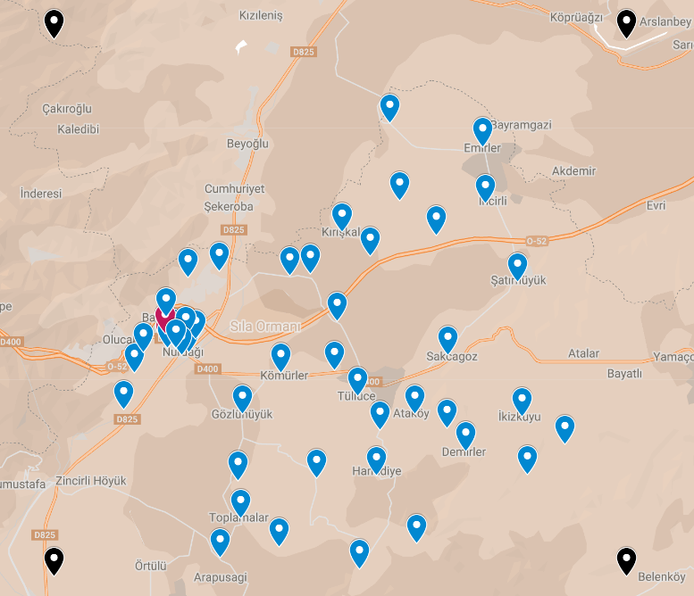
</p>

<p align="center"><em>Locality map of Nurdağı. The black markers enclose the area studied, roughly 1,200 km². The blue markers correspond to the demand locations of the studied problem. The city of Nurdağı is seen left of centre; the depot's position is denoted by a red marker.</em></p>

Positioned within Southeastern Anatolia, Nurdağı lies within one of Turkey's most economically challenged regions and is home to 41,322 people. The area under consideration roughly encompasses 1,200 km². In total, a single depot node and 48 demand nodes, one for each neighbourhood or village of Nurdağı, are considered. Damage to Nurdağı city and the surrounding villages has been severe, and in the days after the disaster, the population density of Nurdağı fell by over 81%.

The needs in severely affected regions such as Nurdağı go beyond immediate disaster relief. The significant proportion of houses that were left destroyed, in addition to diminished food security in the region, speak towards a necessary short to medium-term solution for the efficient distribution of basic needs such as food and water.

| Input | Value |
| --- | --- |
| Demand nodes | 48 demand nodes and a single depot |
| Population | 41,322 people |
| Area | Roughly 1,200 km² |
| Vehicle | Toyota HiAce h200, capacity 2,000 units |
| Relief item | One loaf of *ekmek* per person per day |
| Distances | Google Maps Distance Matrix API, driving mode |

After determining the geographical coordinates of these locations, the Google Maps Distance Matrix Application Programming Interface (API) was used to construct a distance matrix. The measured distances represent the shortest possible route a vehicle must travel between two given points along the road network. A conscious choice was made to refrain from using travel times as the traversal cost of an edge: travel times are highly stochastic and influenced by the time of day, day of week, and seasonal variations. Needless to say, Euclidean distances serve no purpose when transportation via a non-Euclidean road network is considered.

Referencing the Pan American Health Organisation, 1,700 Kcal daily will prevent severe deterioration of the nutritional status, and famine. A typical loaf of Turkish bread, known as ekmek, contains roughly 1,200 kilocalories. Therefore, it is assumed that every individual across all neighbourhoods must receive a loaf of bread as a daily nutritional necessity.

## Stochasticity and dynamism

In real-world scenarios, stochasticity and dynamism are not the exception but the norm. Using simplistic deterministic and static models to understand, let alone optimise, networks that are constantly moving, reorganising, and reacting often falls short of providing accurate solutions.

The pivotal issue being handled by the dynamic element of the SDCVRP is the recognition of imperfect information. Incapacitated reporting channels and communication infrastructure are commonplace following natural catastrophes. Expected demand values should only serve to direct the solution process when there is no alternative. As the actual demand values are revealed, dynamic solution processes are able to adapt to changing problem instances.

Differences between expected and actual demand influence the SDCVRP dramatically. Unexpectedly high demands could mean that a node must be visited multiple times. Conversely, unusually low demand could permit a tour to accommodate additional nodes initially absent from its delivery agenda. Clearly, various constellations of anticipated demand and actual demand exist. Nevertheless, a truly dynamic solution method is capable of handling all possible scenarios.

Instead of modelling stochasticity with low, medium, and high-demand scenarios, sampling demand from probability distributions more accurately reflects scenarios present in real life. Random sampling using a Cauchy distribution assumes that, in volatile environments, demand is heavy-tailed and cannot be approximated by the Normal distribution.

<p align="center">
  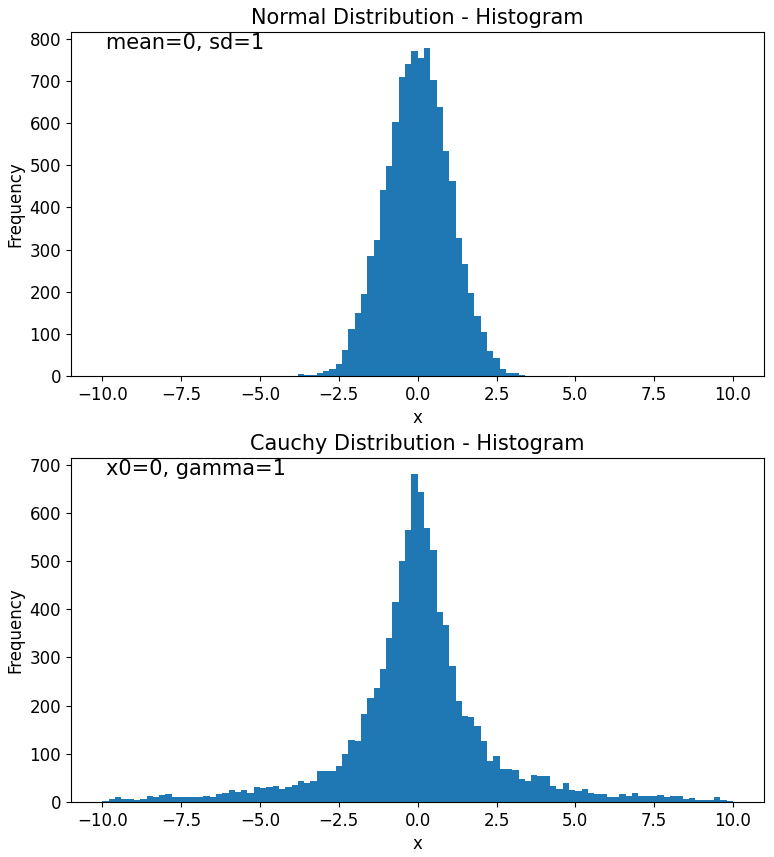
</p>

<p align="center"><em>Side-by-side comparison of the Normal and Cauchy distributions' histograms. A sampling of 10,000 values of each highlights how rare, high-impact events are taken into account differently.</em></p>

Note that the Cauchy distribution has a lower peak than the Normal distribution. Further, the heavy tails of the Cauchy distribution cause the mean and variance to be undefined, and common statistical techniques, such as the central limit theorem, do not apply.

<p align="center">
  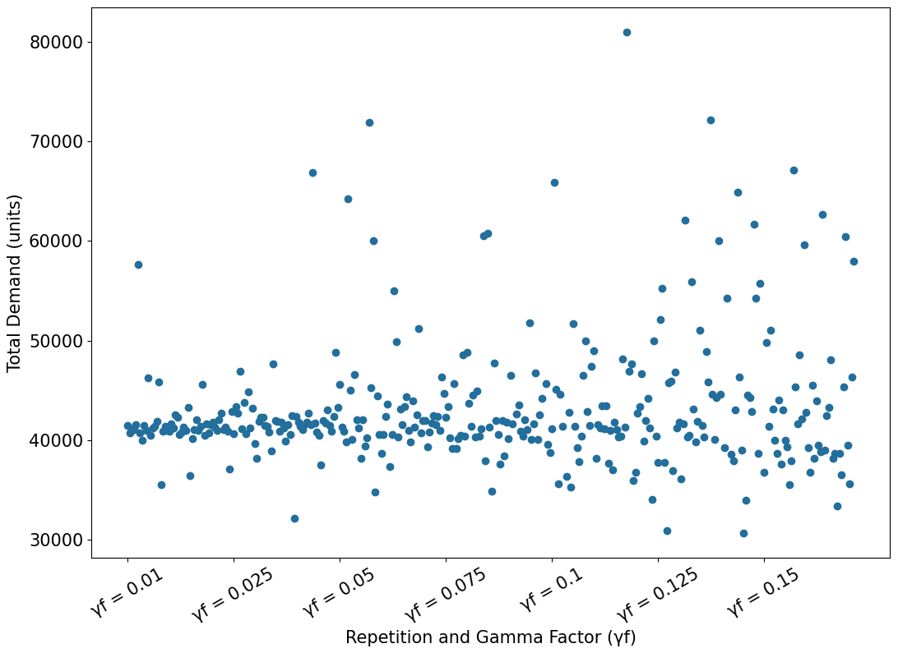
</p>

<p align="center"><em>Total demand for each repetition and gamma factor, without extreme outliers above 100,000 units. As γf increases, demand becomes more volatile, and demand shocks become more severe.</em></p>

Several demand shocks can be observed. These shocks constitute multiples of expected demand values; a maximum value of 532,401 units contrasts heavily with the non-stochastic total network demand of 41,322 units.

## How the algorithm works

The design of the program differentiates between a guiding process and an application process. The guiding process is the process that explores the solution space and decides upon the next, most optimal move. Conversely, the application process executes the move. The SA algorithm optimises and reoptimises a set of tours as the guiding process, while vehicles are routed along these tours in the method `dynamic_sa()`, which can be seen as the application process.

<p align="center">
  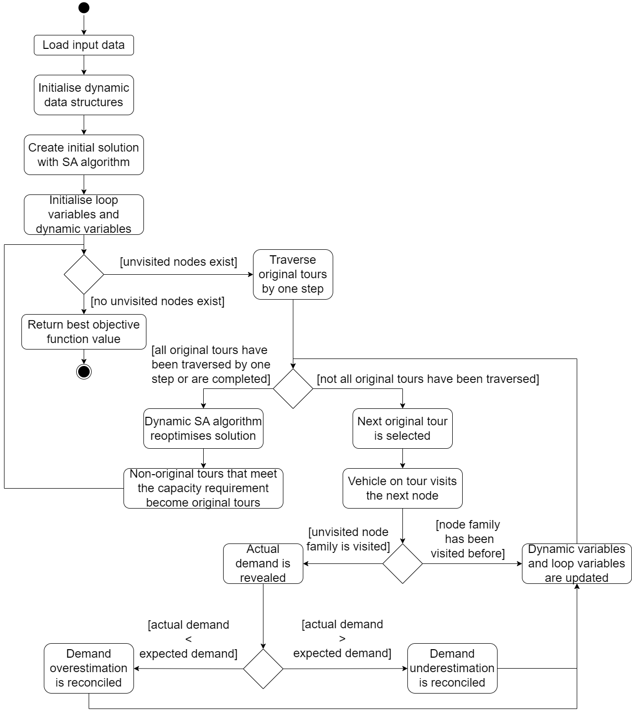
</p>

<p align="center"><em>Activity diagram presenting the functionality of the DSA algorithm. Importantly, this diagram captures the high-level logic of tour traversal and the reconciliation of expected and actual demands.</em></p>

### Node families

Dynamic problems, by definition, transform over time. As such, data structures, such as distance matrices, along with the nodes considered by the problem, must be able to change. This is most evident when the expected demand at a node deviates from the actual demand.

Every physical distribution point in the problem is conceptualised as a node family, and each node family manages a number of child nodes. For example, node family 1 may manage child nodes 1.1, 1.2, 1.3. In the classical, static CVRP, every node may only be visited once. In dynamical problems, multiple visits may be necessary; demand shocks cannot be ruled out. This is why a two-level conceptualisation of single nodes is imperative: the number of child nodes corresponds to the number of visits that are required to satisfy demand at the node. Because this number is separated from the physical node itself, it may change as needed. Likewise, if the number of nodes may grow and shrink, the distance matrix must be able to do the same.

Take, for instance, a truck on the tour (0, 1.1, 2.1, 0), currently at the depot. Assuming a truck has a capacity of 100 units and nodes 1.1 and 2.1 both have a demand of 50 units, this tour is feasible and efficient. Once this truck visits node 1.1, an actual demand of 110 units could be revealed at that node. The tour has become overburdened because of an underestimation of demand. After delivering 100 units to node 1.1, the vehicle must return to the depot to resupply its capacity. Because the demand at node family 1 has not been fully met, an additional child node, node 1.2, with a demand of 10 units, is added to the node family, signifying that an additional visit is required.

Trucks do not begin their journey arbitrarily. Before starting on a tour, a certain utilisation level of the truck must be reached. If this utilisation level equals 0.9, the sum of the expected demand of the nodes served by the tour must be equal to or above 90% of the vehicle's capacity. Tours which meet the predetermined utilisation target are called original tours, whereas those that do not yet meet the requirement are non-original tours.

### The annealing engine

In the same way that a crystalline grid can reform itself to minimise the thermodynamic free energy of its material, a CVRP grid can be reformed to minimise the total distance across all tours. Centrally important to this process is that the algorithm is not trapped in local optima.

<p align="center">
  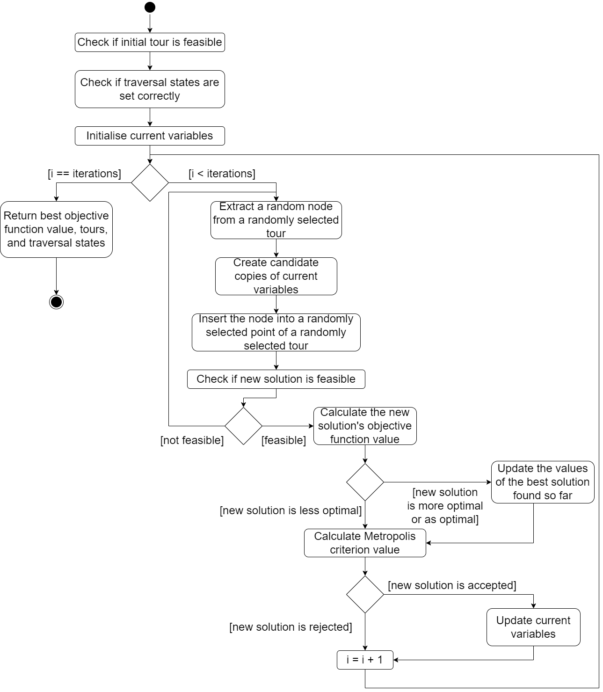
</p>

<p align="center"><em>Activity diagram of the SA section of the overarching DSA algorithm. This part details how new candidate solutions are formed and potentially accepted.</em></p>

The stochastic process chooses a random tour for node extraction. Then, a randomly selected node is removed from the tour. A tour for insertion and an insertion index into this tour are calculated randomly. After the extracted node is inserted, the new candidate solution is checked for feasibility. If the solution is permissible, the objective function evaluates it. Otherwise, the candidate solution is discarded, and the extraction and insertion process repeats to create a new candidate solution.

It must be emphasised that solutions which are more optimal are always accepted, whereas the acceptance of inferior solutions, when compared to the current solution, hinges upon the Metropolis criterion. Higher temperatures accept worse solutions more often than lower temperatures do. This provides the SA algorithm with the ability to free itself from local optima during the entire solving process, refining the candidate solution as temperature decreases.

### Traversal locking

Lock indices and traversal states are calculated that freeze tours up to a certain node. Fundamentally, these variables prevent tours from being optimised retrospectively. A truck currently at node 2 on the tour (0, 1, 2, 0) cannot, in retrospect, find itself on the tour (0, 1, 3, 2, 0) as this would amount to time travel. Lock indices prevent nodes from being placed in the already-traversed sections of tours and forbid nodes that have been traversed from being placed in other tours.

The single extraction and insertion per iteration, as implemented here, considers a changing neighbourhood size. At first, when traversal has not started, there are many neighbouring solutions; any node can theoretically be moved to any other position in all the extant tours. Once traversal begins, this is no longer the case. Nodes can only be inserted into those sections of tours that have not been traversed yet. Larger neighbourhoods explore a larger search space, increasing the chances of finding a solution close to the optimal solution. As the search space shrinks, the near-optimal solution is refined further.

## Experiment 1: parameters and cooling schedules

*How sensitive are the solutions gained by the proposed algorithm to changes in its input parameters?* Every combination of the following parameters is analysed, with 30 trials for each constellation: initial temperature [10; 100; 1,000], iteration count [10; 100; 1,000], and utilisation target [1, 0.9, 0.5, 0.25, 0].

<p align="center">
  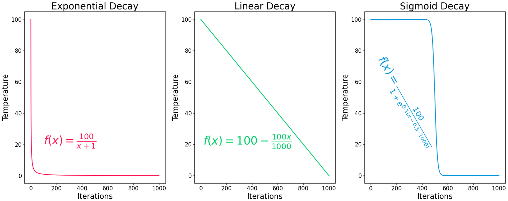
</p>

<p align="center"><em>Side-by-side comparison of the exponential, linear, and sigmoid temperature schedules.</em></p>

<p align="center">
  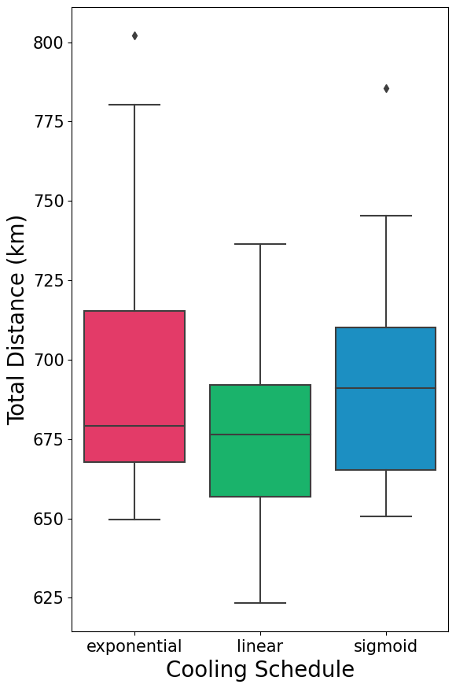
</p>

<p align="center"><em>Comparison of objective value for different cooling schedules (initial temperature = 100, iterations = 1,000, utilisation target = 0.9). Different cooling schedules have little impact on solution quality.</em></p>

Surprisingly, none of the cooling schedules were able to prove themselves clearly superior in terms of solution quality. Trucks depart on tours and certain nodes become fixed in the transportation schedule, thereby preventing the visited nodes from being placed elsewhere in the collection of tours. It follows that as an increasing number of nodes is visited, a steadily decreasing number of nodes can be reordered optimally by the program. This causes the SA algorithm to become stuck in local optima that even different temperature schedules are unable to free it from. Varying the utilisation targets also had no effect on the objective value.

<p align="center">
  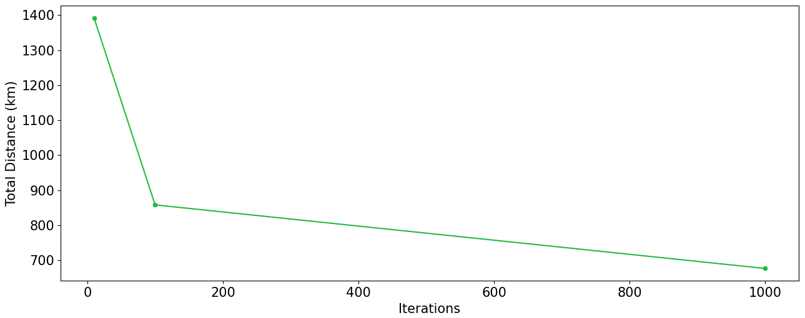
</p>

<p align="center"><em>Impact of iteration count on objective value (linear decay, initial temperature = 100, utilisation target = 0.9). Increasing the iteration count is subject to diminishing returns in solution value improvement.</em></p>

| Iterations | Mean distance | Mean execution time |
| ---: | ---: | ---: |
| 10 | 1,398 km | 1.0 s |
| 100 | 867 km | 5.5 s |
| 1,000 | **686 km** | 46.5 s |

The only input parameter that had an appreciable optimising effect on the objective value was the iteration count. Increasing this variable broadened the examined solution space early in the solution process before the gradual visitation of nodes entrapped the results in local optima. Although higher iteration counts promise to deliver superior solutions, these must be balanced by simultaneously increasing execution times. An ordinary least squares regression on the average execution times when the initial temperature was set to 1,000 reveals the following linear relationship: `y = 0.04912x + 0.70302`.

## Experiment 2: performance against an exact method

*What differences in solution quality exist between the algorithm and an exact solution method in a static and deterministic environment?* The exact solution method was implemented in the mathematical IBM ILOG CPLEX optimiser. Because this process can demand a significant amount of time, a computational time limit of 120 seconds was imposed on CPLEX to allow for a fair comparison between the two solution methods. It would be academically dishonest to impose a fraudulently low time limit on the CPLEX engine, thereby emphasising the comparative advantage of the DSA algorithm.

<p align="center">
  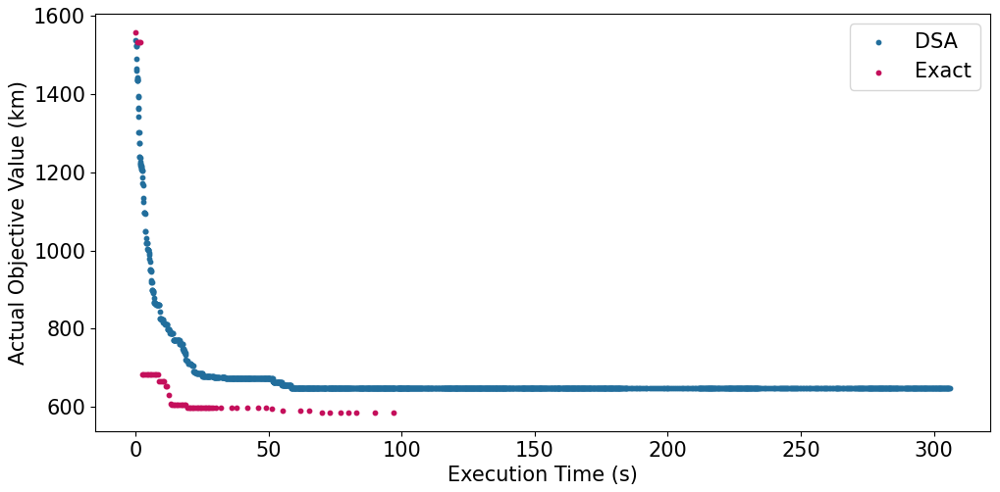
</p>

<p align="center"><em>Convergence to optimal solution by DSA and exact algorithms. Both algorithms improve upon their initial solutions rapidly before asymptotically levelling and failing to improve further. The increased execution time of the DSA solution method is due to the data collection for the above graph.</em></p>

| Algorithm | Mean | Min | Max | Range | IQR | SD |
| --- | ---: | ---: | ---: | ---: | ---: | ---: |
| DSA | 676,189 | 623,270 | 736,480 | 113,210 | 35,355 | 25,332 |
| Exact (1 thread) | 602,090 | 591,803 | 603,779 | 11,976 | 1,217 | 3,002 |
| Exact (8 threads) | **583,128** | 580,068 | 585,584 | 5,516 | 1,782 | **1,648** |

*All values are presented in metres rounded to the nearest integer.*

The superiority of the exact algorithm, even when constrained to 120 seconds, is clear. Running on a single thread, the exact algorithm provides, on average, solution values that are 12.31% smaller than the DSA algorithm. Variability in solution values is also lower when comparing both algorithms running on the same number of threads: the IQR is smaller by a factor of 29. On average, the exact algorithm, running on 8 threads, generates tours that are 15.96% shorter.

Experiment 2 communicated the superiority of the CPLEX solver to the proposed algorithm in static demand environments. Moreover, the wide range and IQR of the solutions garnered by the DSA algorithm indicate a tendency for it to become caught in local optima. The only comparative advantage the DSA algorithm has over exact solution methods is in computation speed. Nevertheless, the collected data shows that in static environments, CPLEX dominates.

## Experiment 3: performance under information uncertainty

*What differences in performance can be observed as the problem setting becomes increasingly stochastic?* Stochasticity is introduced to create a true SDCVRP. Expected demand values for nodes stay as they are; however, now actual demand values differ from expectations. Seven gamma factors were chosen instead of gamma values. Gamma factors connect stochasticity levels to the expected node demand. For each γf level, 50 stochastic problem instances were solved via DSA, while the global optimal solution was evaluated against the same 50 instances.

<p align="center">
  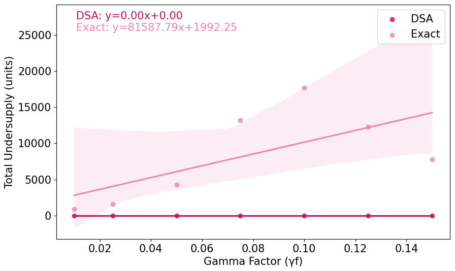
  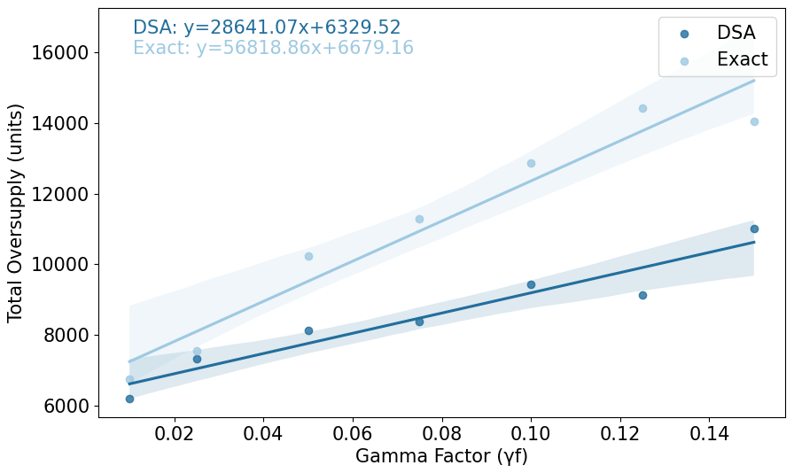
</p>

<p align="center"><em>Left: total undersupply levels at various gamma factors. Right: total oversupply levels.</em></p>

Oversupply is defined as the level of remaining capacity in a vehicle after it has completed its tour. By contrast, undersupply is the total demand that could not be fulfilled by a single vehicle on its assigned tour. The service level is the proportion of demand met over total demand across all nodes.

The DSA solution produces no undersupply, effectively covering the network's total demand. This poses a striking contrast to the performance of the exact solution method, where undersupply increases along with stochasticity. Oversupply increases with both the DSA and exact algorithms; however, oversupply is consistently lower and rises at a lower rate in the DSA solutions. In the DSA solution, the reason for the increase in oversupply is due to the progressive increase in tours. Generally, the unpredictable demand of the problem dictates that trucks always return with some spare capacity: the more tours there are, the more oversupply is observed.

<p align="center">
  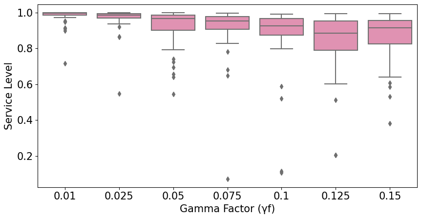
</p>

<p align="center"><em>Service level of the exact algorithm's solutions at various gamma factors. While the service level deteriorates with increased stochasticity, its variance increases. As a result, the performance of the exact solution method becomes worse and less reliable.</em></p>

The steady escalation in the variability of the service level in the exact solution mirrors the broadening dispersion of demand values. Additionally, the median service level of the exact solution deteriorates when volatility increases. Outliers are common at all γf levels: these correspond to demand shocks where demand is significantly higher than anticipated. One must also note that as the demand becomes less predictable, the magnitude of the outliers increases.

<p align="center">
  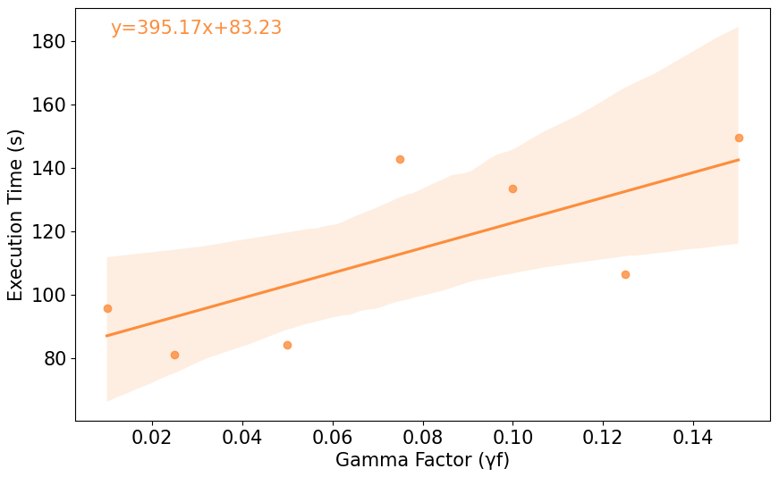
</p>

<p align="center"><em>DSA algorithm execution times at various gamma factors. Increased demand fluctuation leads to increased execution times as more data must be processed and managed by the algorithm's functions and data structures.</em></p>

The DSA algorithm's execution time also suffers from increasing γf. Rising stochasticity leads to a gradual increase in the average total demand and to an amplification of outlier magnitude. For the DSA, this means that more tours and child nodes must be managed, thereby lengthening the time of tour traversal and reconciliation. Indeed, a Pearson correlation coefficient of 0.92 is calculated between demand and execution time, indicating a strong positive relationship.

### Conclusion

In static environments, CPLEX provided superior solutions. However, in dynamic environments, the opposite was true. The proposed DSA solution method of the SDCVRP outperformed the exact solution method when stochastic demand was sampled from the heavy-tailed Cauchy distribution.

## Installation

```bash
git clone https://github.com/Kilian-S/DynamicStochasticSA.git
cd DynamicStochasticSA

python3 -m venv .venv
source .venv/bin/activate        # Windows: .venv\Scripts\activate

pip install -r requirements.txt
```

Python 3.10 or newer. The solver itself requires only `numpy`, `pandas` and `openpyxl`.

Reproducing the exact solution additionally requires IBM ILOG CPLEX via `docplex`. Rebuilding the distance matrix from geographical coordinates requires a Google Maps API key in the `GOOGLE_MAPS_API_KEY` environment variable. Neither is needed to run the DSA, as the constructed distance matrix is committed.

## Quickstart

```python
import numpy as np

from dynamic_behaviour import dynamic_sa
from inputs.node import InputNode
from simulated_annealing import objective

# id, expected demand, actual demand revealed on visitation
nodes = [
    InputNode('0', 0, 0),        # depot
    InputNode('1', 1000, 10),
    InputNode('2', 400, 3300),
    InputNode('3', 700, 1000),
    InputNode('4', 200, 3000),
]

distance_matrix = np.array([
    [0, 10, 15, 20, 12],
    [10, 0, 35, 25, 44],
    [15, 35, 0, 30, 10],
    [20, 25, 30, 0, 4],
    [12, 44, 10, 4, 0],
])

distance, tours, execution_time, final_nodes = dynamic_sa(
    nodes, distance_matrix, objective,
    initial_temperature=100, iterations=1000,
    vehicle_capacity=600, utilisation_target=0.9,
)
```

The Nurdağı problem instance:

```python
from inputs.instance import DISTANCES_FILE, NODES_SHEET, read_instance_distance_matrix
from inputs.node import create_nodes_static, create_nodes_cauchy_dependent_on_expected_demand

nodes = create_nodes_static(DISTANCES_FILE, NODES_SHEET)                                     # deterministic
nodes = create_nodes_cauchy_dependent_on_expected_demand(DISTANCES_FILE, NODES_SHEET, 0.10)  # stochastic
distance_matrix = read_instance_distance_matrix()
```

From the command line:

```bash
python -m examples.main
python -m experiments.experiment_1_parameter_sensitivity_analysis.parameter_sensitivity_analysis
python -m experiments.experiment_3_stochastics.stochastics
```

## Repository structure

```
.
├── simulated_annealing.py   # SA engine, objective function, feasibility constraints
├── dynamic_behaviour.py     # tour traversal and reconciliation of expected and actual demand
├── inputs/                  # nodes, node families, dynamic distance matrix, data collection
├── static/                  # exact solution method (IBM ILOG CPLEX)
├── experiments/             # the three computational experiments and their result sets
├── examples/                # runnable example and the references that informed the design
├── errors/                  # domain-specific exceptions
├── docs/images/             # figures
└── tests/                   # 46 unit and integration tests
```

## Tests

```bash
python -m pytest
```

The tests assert the constraints of the integer linear program: every node is visited at least once, the total demand served by a single tour is constrained by the vehicle capacity, and all tours start and end at the depot.

## Assumptions and limitations

The implementation of the DSA algorithm hinges upon several assumptions.

1. Large disaster-affected regions are split into multiple smaller subregions. Each of these subregions is served by a single depot acting as a replenishment hub for distribution vehicles.
2. Demand nodes exist and are road accessible. Demand at these locations is stochastic and determined by sampling from a probability distribution.
3. There is no limitation on the number of drivers and vehicles in a subregion. Vehicles are of the same type and have uniform carrying capacities.
4. The distribution network delivers only a single type of relief item, of which there is assumed to be no shortage.
5. Every node must be visited at least once to address issues of information uncertainty. Expected demand values are considered to be unreliable.
6. A single time period equal to one day is considered.
7. Sufficient communications infrastructure exists for vehicles to report actual demand figures to the central organising unit. This is necessary for reoptimisation to take place.
8. The manageable size of the distribution area allows all nodes to be visited within a day, unaffected by time-related restrictions like day-night cycles.

Further, the limits of the applicability of the proposed problem definition and solution model are as follows.

1. Only last-mile distribution is considered. Previous parts of the supply chain are assumed to be operational.
2. Exclusively transportation via the road network is considered.
3. The scope does not extend to the journeys that those in need make to the different aid distribution sites.
4. Emergent properties of the scale of networks are non-negligible. While the DSA solution method is adaptable to delivery problems of varying sizes, number of people supplied, or geographical areas, it must be modified accordingly in order to function effectively.

The Cauchy distribution's heavy tails require high numbers of experiment repetitions to assess low-probability, high-impact events; here, conducting 100,000 repetitions would yield more of these disproportionately impactful events to study algorithm behaviour with. Overall, computational resources were a limiting factor in running trials for the experiments. Finally, the committed result sets were produced before several bugs in the implementation were corrected, most consequentially in how the search tracks its best-found solution, so a rerun will not reproduce these figures exactly.

## Contributing

I warmly welcome any contributions! Your insights can make a significant impact and help improve this project. If you have ideas for new features, suggestions for enhancements or have found a bug, I would be glad to hear from you.

For those interested in contributing directly with code, I invite you to create a fork of the repository, make your changes, and then submit a pull request. I can then review and potentially merge your changes into the main code base. Please ensure your code aligns with the same standards and conventions used in the current code.

If you're planning to contribute to research based on this project or wish to discuss larger changes, please reach out to me first. This allows me to guide your efforts, prevent duplication, and help you understand the design and implementation decisions that may impact your work.

## Licence

This project is licensed under the GNU General Public License v3.0 - see the [LICENSE](./LICENSE.txt) file for details.

This means that you're free to do almost anything with this project, like distributing, modifying, or selling it, under the condition that when you distribute the project, the same license is applied, so that any recipients also have these freedoms. Please note that this project is distributed WITHOUT ANY WARRANTY.

For more information on the GNU General Public License v3.0, please visit https://www.gnu.org/licenses/gpl-3.0.html.

## Contact

Feel free to communicate regarding this project at [sdcvrp@gmail.com](mailto:sdcvrp@gmail.com). I greatly appreciate your interest and am excited to hear from you!

-Kilian Xhen Schwarz

Submitted as a *Wissenschaftliche Arbeit zur Erlangung des Grades Bachelor of Science an der Technischen Universität München*, Chair of Operations Management. Referent: Prof. Dr. Rainer Kolisch. Betreuer: M.Sc. Baturhan Bayraktar. Eingereicht am 03.08.2023.
