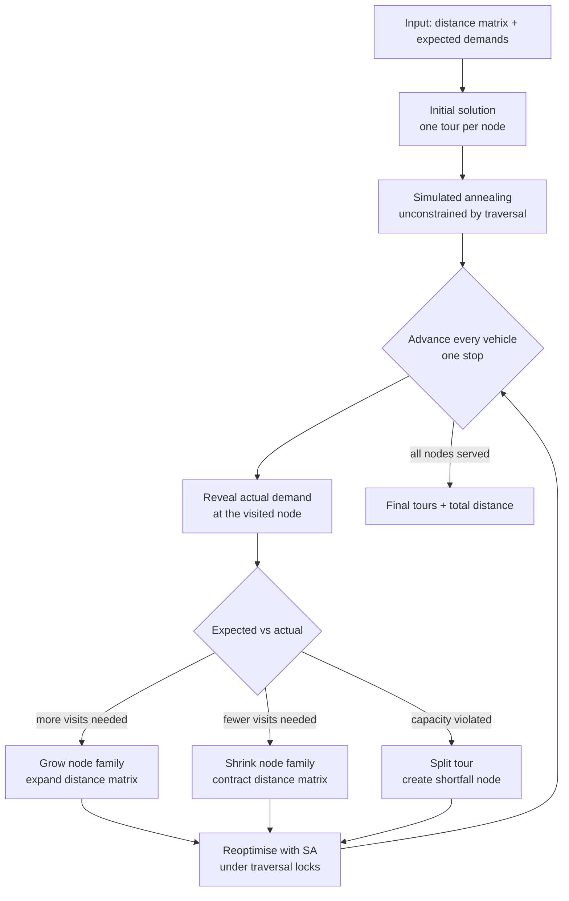

# Dynamic Simulated Annealing for the Stochastic and Dynamic CVRP

[](https://www.python.org/downloads/)
[](./LICENSE.txt)

A metaheuristic solver for the **Stochastic and Dynamic Capacitated Vehicle Routing Problem (SDCVRP)**, in which
customer demand is unknown until a vehicle arrives and routes must be repaired and reoptimised mid-execution.

The solver is evaluated on a humanitarian relief case study built from the February 2023 Turkey-Syria earthquake,
using the 48 settlements of the Nurdağı district (Gaziantep Province, Türkiye).

---

## Table of contents

- [Motivation](#motivation)
- [Problem definition](#problem-definition)
- [Method](#method)
- [Repository structure](#repository-structure)
- [Installation](#installation)
- [Quickstart](#quickstart)
- [Experiments and results](#experiments-and-results)
- [Scope and limitations](#scope-and-limitations)
- [Tests](#tests)
- [Contributing](#contributing)
- [Licence](#licence)
- [Contact](#contact)

---

## Motivation

Simulated Annealing (SA) is a well-established metaheuristic for the classical Capacitated Vehicle Routing Problem
(CVRP), where every customer's demand is known before the first vehicle leaves the depot. Disaster relief does not
work that way. Aid convoys are dispatched into settlements whose true needs are only discovered on arrival, so a
route planned at *t = 0* is frequently invalid by *t = 1*.

The literature on SA applied to the *stochastic and dynamic* variant is thin. This project closes part of that gap
by building a solver that reoptimises continuously as demand is revealed, and by measuring what that adaptivity is
worth against an exact solution computed with perfect hindsight.

The headline finding: **the dynamic solver sustains a 100% service level across every demand-volatility level
tested, while a statically optimal plan degrades to 84%, and it pays for this with roughly 18-57% additional
distance travelled.**

## Problem definition

Given a depot, a set of demand nodes, a symmetric distance matrix and a homogeneous fleet of capacitated vehicles,
find a set of tours minimising total distance travelled, subject to:

| Constraint | Meaning |
| --- | --- |
| Visitation | every demand node is served |
| Flow conservation | every demand node is entered and left exactly once |
| Vehicle capacity | the demand served on a tour does not exceed vehicle capacity |
| Depot start / end | every tour begins and ends at the depot |

What makes the instance *stochastic and dynamic*:

- **Stochastic** — each node has an *expected* demand (the planning estimate) and an *actual* demand (the truth).
  Actual demand is drawn from a heavy-tailed Cauchy distribution, chosen because relief needs are prone to extreme
  outliers that a Gaussian model understates.
- **Dynamic** — actual demand is revealed only when a vehicle arrives. A node whose true demand exceeds what the
  vehicle carries requires additional visits; a node whose true demand collapses frees capacity. The number of
  required stops therefore changes *while the solution is being executed*.

## Method

The solver combines a constraint-aware SA engine with a dynamic execution layer.



### The annealing engine — [`simulated_annealing.py`](./simulated_annealing.py)

A candidate solution is generated by extracting one node at random and reinserting it at a random position in a
random tour, which may be an empty tour, so the search can merge tours and split them. Candidates that reduce total
distance are always accepted. Candidates that increase it are accepted with probability `exp(-Δ/T)` (the Metropolis
criterion), so the search can escape local optima early on and settles as the temperature falls.

Four cooling schedules are implemented (`exponential`, `linear`, `concave`, `sigmoid`) and selected with the
`cooling_schedule` argument. **Linear decay** is the default and the schedule used for the reported results.

Two variants are provided:

- `simulated_annealing(...)` — unconstrained, used to produce the initial plan.
- `simulated_annealing_with_dynamic_constraints(...)` — respects *traversal states*. Once a vehicle has passed a
  stop, that prefix of the tour is **locked**: no node may be inserted before it, because doing so would amount to
  time travel. Only the untraversed suffix is available to the neighbourhood operator.

### The dynamic layer — [`dynamic_behaviour.py`](./dynamic_behaviour.py)

Two data structures carry the dynamism:

- **Node family** ([`inputs/node_family.py`](./inputs/node_family.py)) — one physical settlement maps to one
  *family*. A family whose demand exceeds vehicle capacity decomposes into several *child nodes*
  (`⌈demand / capacity⌉` of them), each representing one vehicle-load visit. When actual demand is revealed the
  family is recomputed, so children appear and disappear as the truth arrives.
- **Dynamic distance matrix** ([`inputs/dynamic_distance_matrix.py`](./inputs/dynamic_distance_matrix.py)) — a
  distance matrix that grows and shrinks in step with the node families, cloning a parent's row and column whenever
  a new child node is created.

Each outer iteration advances every vehicle by one stop, reconciles expected against actual demand, splits any tour
whose capacity constraint has been violated (the overflow becomes a new *shortfall node* served by a follow-up
tour), and reruns SA on whatever remains untraversed. New tours are held back at the depot until they reach a
configurable **utilisation target**, so vehicles are not dispatched half-empty.

For an end-to-end walkthrough on a five-node instance, see [`examples/main.py`](./examples/main.py) or the
integration tests in [`tests/test_dynamic_behaviour.py`](./tests/test_dynamic_behaviour.py).

## Repository structure

```
.
├── simulated_annealing.py   # SA engine, objective function, feasibility checks
├── dynamic_behaviour.py     # dynamic execution loop and demand reconciliation
├── inputs/                  # nodes, node families, dynamic distance matrix, data loading
├── static/                  # exact CVRP baseline (CPLEX / docplex)
├── experiments/             # the three experiments, their result sets and figures
│   ├── experiment_1_parameter_sensitivity_analysis/
│   ├── experiment_2_perfect_information/
│   ├── experiment_3_stochastics/
│   └── graphics/            # maps and distribution plots
├── examples/                # reference implementations that informed the design
├── errors/                  # domain-specific exceptions
└── tests/                   # unit and integration tests
```

`inputs/instance.py` resolves the bundled data set relative to the repository, so every script and test finds it
regardless of the directory it is run from.

## Installation

```bash
git clone https://github.com/Kilian-S/DynamicStochasticSA.git
cd DynamicStochasticSA

python3 -m venv .venv
source .venv/bin/activate        # Windows: .venv\Scripts\activate

pip install -r requirements.txt
```

Requires **Python 3.10 or newer**.

The core solver depends only on `numpy`, `pandas` and `openpyxl`. Reproducing the exact baseline additionally
requires IBM CPLEX via `docplex`; regenerating the distance matrix from geographic coordinates requires a Google
Maps Distance Matrix API key, supplied through the `GOOGLE_MAPS_API_KEY` environment variable. Neither is needed to
run the solver on the bundled data.

## Quickstart

```python
import numpy as np

from dynamic_behaviour import dynamic_sa
from inputs.node import InputNode
from simulated_annealing import objective

# Five nodes: id, expected demand (the plan), actual demand (the truth, revealed on arrival)
nodes = [
    InputNode('0', 0, 0),        # depot
    InputNode('1', 1000, 10),    # heavily over-estimated
    InputNode('2', 400, 3300),   # heavily under-estimated
    InputNode('3', 700, 1000),
    InputNode('4', 200, 3000),
]

distance_matrix = np.array([
    [0, 10, 15, 20, 12],
    [10, 0, 35, 25, 44],
    [15, 35, 0, 30, 10],
    [20, 25, 30, 0, 4],
    [12, 44, 10, 4, 0],
])

distance, tours, execution_time, final_nodes = dynamic_sa(
    nodes,
    distance_matrix,
    objective,
    initial_temperature=100,
    iterations=1000,
    vehicle_capacity=600,
    utilisation_target=0.9,
)

print(f"Total distance: {distance}")
print(f"Tours: {tours}")
```

To run the full Nurdağı case study, load the bundled instance instead:

```python
from inputs.instance import DISTANCES_FILE, NODES_SHEET, read_instance_distance_matrix
from inputs.node import create_nodes_static, create_nodes_cauchy_dependent_on_expected_demand

# Deterministic: actual demand turns out to equal expected demand
nodes = create_nodes_static(DISTANCES_FILE, NODES_SHEET)

# Stochastic: actual demand is drawn from a Cauchy distribution whose scale is 10% of expected demand
nodes = create_nodes_cauchy_dependent_on_expected_demand(DISTANCES_FILE, NODES_SHEET, 0.10)

distance_matrix = read_instance_distance_matrix()
```

Or run it straight from the command line:

```bash
python -m examples.main
```

## Experiments and results

The case study instance comprises **48 settlements** in the Nurdağı district, real road distances from the Google
Maps Distance Matrix API, and a vehicle capacity of 2,000 units. Distances are reported in metres.

### Experiment 1 — Parameter sensitivity

45 parameter configurations (initial temperature × iterations × utilisation target) × 30 trials = **1,350 runs**.

| Iterations | Mean distance | Mean runtime |
| ---: | ---: | ---: |
| 10 | 1,397,747 | 1.0 s |
| 100 | 866,548 | 5.5 s |
| 1,000 | 685,750 | 46.5 s |

Iteration count dominates solution quality; initial temperature (10 / 100 / 1,000) shifts the mean by under 0.6%,
and the utilisation target by under 0.7%. The best configuration was `T₀ = 1000, iterations = 1000,
utilisation target = 1.0`, at a mean distance of **672,192** in 51 s.

### Experiment 2 — Perfect-information baseline

An exact MIP formulation of the same instance, solved with CPLEX under a 120-second time limit, 30 trials.

| Metric | Value |
| --- | ---: |
| Mean objective | 583,128 |
| Standard deviation | 1,648 |
| Runtime | time-limited at 120 s |

Every run hit the time limit, so this is the best incumbent found within the budget rather than a proven optimum.
It is nevertheless a demanding benchmark: it assumes demand is known in advance, an advantage the dynamic solver
never has.

### Experiment 3 — Performance under demand uncertainty

7 volatility levels × 50 trials = **350 runs**. Actual demand is drawn from a Cauchy distribution centred on the
expected demand with scale `γ = γ_factor × expected demand`, so larger settlements carry proportionally larger
uncertainty. The dynamic solver is compared against the Experiment 2 static plan executed against the same revealed
demand.

| γ factor | DSA distance | DSA service level | Static service level | DSA undersupply | Static undersupply |
| ---: | ---: | ---: | ---: | ---: | ---: |
| 0.010 | 690,525 | **100.0%** | 98.1% | 0 | 887 |
| 0.025 | 704,334 | **100.0%** | 96.8% | 0 | 1,580 |
| 0.050 | 709,669 | **100.0%** | 91.7% | 0 | 4,244 |
| 0.075 | 741,755 | **100.0%** | 91.2% | 0 | 13,166 |
| 0.100 | 888,388 | **100.0%** | 87.5% | 0 | 17,686 |
| 0.125 | 912,484 | **100.0%** | 84.1% | 0 | 12,286 |
| 0.150 | 794,954 | **100.0%** | 86.2% | 0 | 7,746 |

**Interpretation.** The dynamic solver never leaves demand unserved: when a settlement turns out to need more than
planned, it splits the tour and dispatches a follow-up. The static plan cannot react, and its service level falls
away as volatility rises, leaving up to 17,686 units of demand unmet. The price of that robustness is distance: the
dynamic solver travels 18-57% further than the perfect-information baseline.

Results at γ = 0.125 and above are not monotone. This is expected rather than anomalous: the Cauchy distribution
has no defined mean or variance, so at high scale parameters a handful of extreme draws dominates the sample and 50
trials is not enough to stabilise the estimate.

Raw result sets are committed as `.xlsx` files alongside each experiment, and each experiment can be rerun
directly:

```bash
python -m experiments.experiment_1_parameter_sensitivity_analysis.parameter_sensitivity_analysis
python -m experiments.experiment_3_stochastics.stochastics
```

The committed result sets were produced by the implementation as it stood at the time of the thesis. Several
defects have been fixed since, most consequentially in how the annealing search tracks its best solution, so a
rerun will not reproduce these figures exactly. The qualitative findings are unaffected.

## Scope and limitations

Honest boundaries on what the results support:

- **Vehicles are assumed available on demand.** The model does not cap fleet size, so a new tour can always be
  dispatched. Real relief operations are fleet-constrained.
- **Travel time is proportional to distance.** No road damage, congestion or time windows are modelled, all of
  which matter in a post-earthquake setting.
- **Research code.** This was written to produce the thesis results, not as a production library. The solver and
  its tests run clean, but the code is optimised for being read alongside the thesis rather than for reuse.

## Tests

```bash
python -m pytest
```

46 unit and integration tests covering the annealing engine, the feasibility constraints, the node family and
distance matrix bookkeeping, the demand reconciliation paths, and end-to-end runs on both the toy instance and the
48-node case study. The end-to-end tests assert the invariants the approach depends on: every revealed visit is
served exactly once, every tour starts and ends at the depot, and no vehicle is ever loaded beyond its capacity.

## Contributing

Contributions are welcome. If you have found a bug, have an idea for a feature, or want to suggest an enhancement,
please open an issue.

To contribute code, fork the repository, make your changes on a branch, and open a pull request. Please match the
conventions already used in the codebase and include tests for new behaviour.

If you are planning research based on this project, or want to discuss a larger change, please get in touch first
so I can point you at the relevant design decisions and we can avoid duplicating effort.

## Licence

Licensed under the **GNU General Public License v3.0** — see [LICENSE.txt](./LICENSE.txt).

You are free to use, modify and distribute this work, including commercially, provided that derivative works are
distributed under the same licence so that recipients retain the same freedoms. The software is provided without
warranty of any kind. Full text: <https://www.gnu.org/licenses/gpl-3.0.html>.

## Contact

Kilian Xhen Schwarz — [sdcvrp@gmail.com](mailto:sdcvrp@gmail.com)

Developed as a bachelor thesis project at the Technical University of Munich (TUM).
